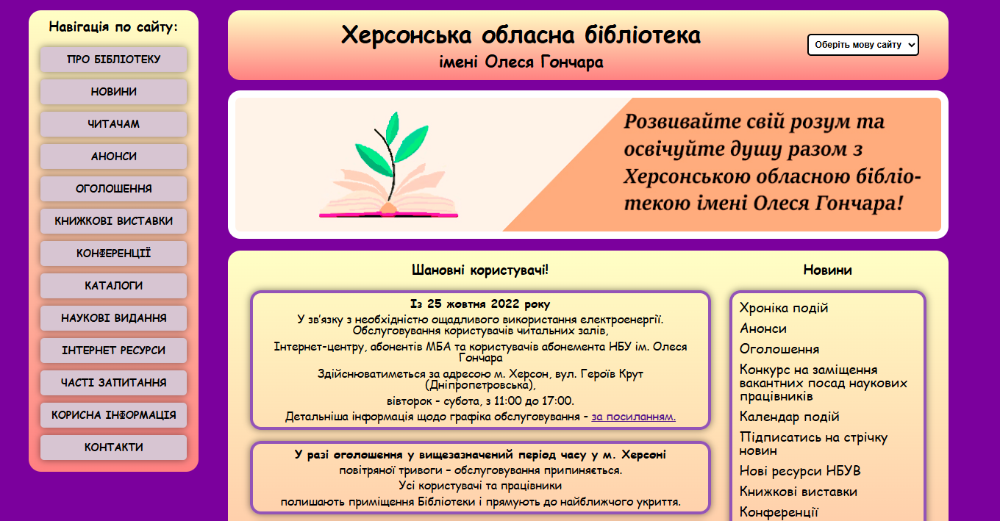
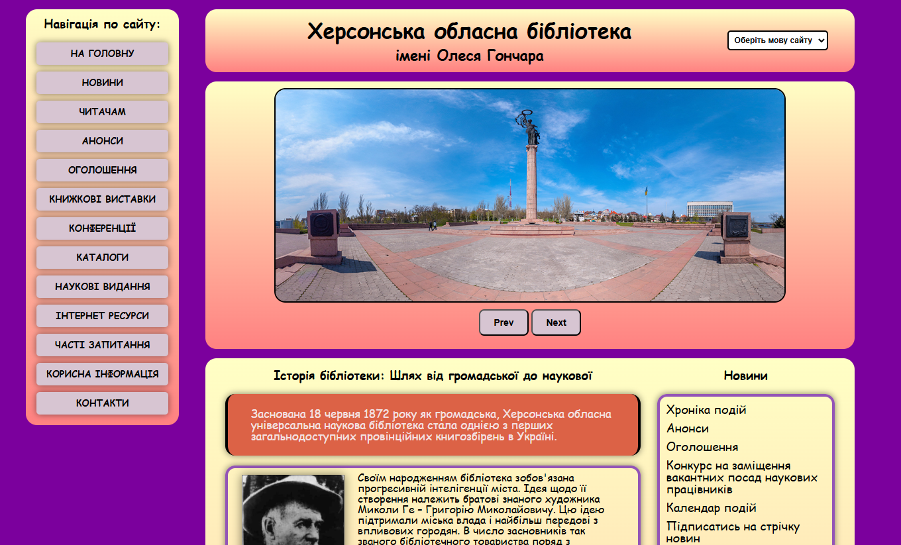

# Library-site

## Description

Library-site is a responsive multi-page website for a library with multilingual support and interactive functionality.

The website is fully responsive and adapted for different screen resolutions.

---

## Development Tools

---

## Technologies

---

## Features

* Multilingual support
* Responsive design
* Sidebar navigation menu
* Image slider
* SCSS architecture with reusable mixins
* Interactive language switcher
* Adaptive layout for multiple screen sizes

---

## Preview

### Home page

### Image slider

---

## Functionality

### Language Switching

The project uses JavaScript to switch between Ukrainian and English versions of the pages through a select menu.

### Slider

The slider supports:

* adaptive image width
* next/previous navigation
* automatic resizing on screen changes

### Responsive Design

The layout is optimized for:

* tablets
* laptops
* Full HD monitors
* large screens up to 2560px

---

## Purpose

This project was created for educational purposes to practice:

* HTML structure
* SCSS styling
* responsive web design
* JavaScript DOM interaction

---

## Possible Improvements

* Add backend integration
* Add dark mode
* Improve SCSS architecture
* Add search functionality
* Optimize project structure
* Improve accessibility
